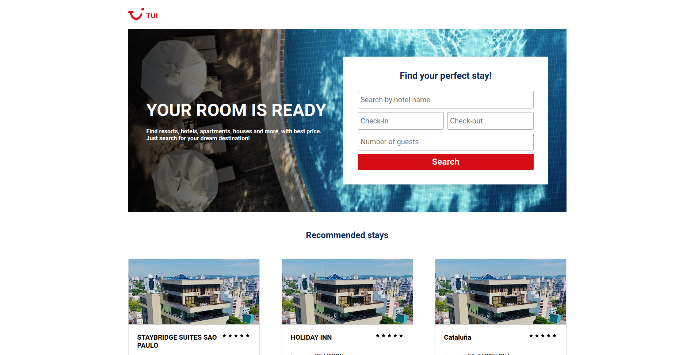

<h1 align="center">
</h1>

<p align="center">
  <a href="#rocket-technologies">Technologies</a>&nbsp;&nbsp;&nbsp;|&nbsp;&nbsp;&nbsp;
  <a href="#information_source-how-to-use">How To Use</a>&nbsp;&nbsp;&nbsp;|&nbsp;&nbsp;&nbsp;
</p>



## :rocket: Preview https://find-hotel.vercel.app/

## :rocket: Technologies

This project was developed for a test with the following technologies:

- [vue](https://vuejs.org/)
- [nuxt](https://nuxtjs.org/)
- [core-js](https://github.com/zloirock/core-js)
- [vue-router](https://router.vuejs.org/)
- [jest](https://jestjs.io/)
- [sass](https://sass-lang.com/)
- [prettier](https://prettier.io/)
- [eslint](https://eslint.org/)


## :information_source: How To Use

To clone and run this application, you'll need [Git](https://git-scm.com) and [YARN](https://yarnpkg.com/) on your computer. From your command line:

```bash
# Clone this repository
$ git clone https://github.com/Eronbello/find-hotel.git

# Go into the repository
$ cd find-hotel

# install dependencies
$ yarn

# You can see the app running at: http://localhost:3000
$ yarn dev
```
## :information_source: Tests

To run the application tests, follow these steps:

```bash
$ yarn test
```

## :rocket: Improvements

Possible improvements

- Add tests to api services
- Add utility classes
- Add i18n
- Add custom favicon
- Improve detail page layout

## :rocket: Explanations

I decided not to use SSR as I am using a lib for the datepicker and it does not support SSR

